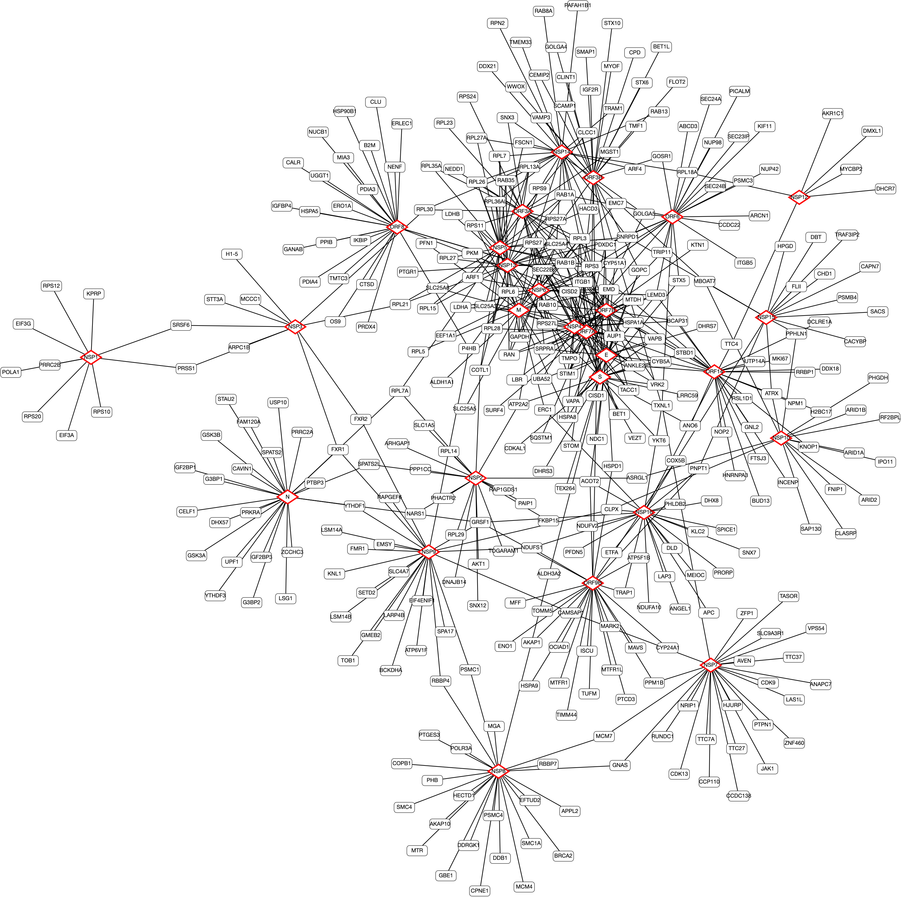

# Lab 5 - Random Walk Simulator

In this lab, you will run different random walk simulations on the undirected, unweighted [SARS-CoV-2 - host proximity interactome](https://www.biorxiv.org/content/10.1101/2020.09.03.282103v1) by Payman Samavarchi-Tehrani and colleagues. This interactome is hot off the press, it was posted as a preprint earlier in September. For more information, take a look at their [project website](https://covid19interactome.org/).  

:arrow_right: Random walks can be applied to directed or undirected networks, which may be weighted or unweighted.  Here, we will simulate random walks on undirected, unweighted networks.

The `proximity-network.txt` file contains the top 25 proximity interactions for each of the 29 viral proteins (from their [Supplementary Table 4](https://www.biorxiv.org/content/10.1101/2020.09.03.282103v1.supplementary-material)).  This is an undirected, unweighted network, and the `lab_utils.get_graph()` function returns a `nodes` set, an `edges` list, and an `adj_list` adjacency list for the graph.  First, add your email and password in the `lab5.py` file and run it.  This code automatically visualizes a GraphSpace graph by calling functions from `lab_utils.py`.  



:arrow_right: With 377 nodes and 599 edges, this network is starting to be a challenge for GraphSpace to visualize.  The Spring Embedder layout does a decent job of laying out this graph.  

## :star: **Task A:** Perform a Random Walk Simulation

There are efficient ways to calculate the probability that a walker is at a node, but here we will simulate a random walker for 100,000 steps. To choose edges randomly, we will use the [`random` Python module](https://docs.python.org/3/library/random.html). The command `random.choice()` will return a random value from the list or set as input.  Using the `random` module:

1. Randomly select a node to begin the random walk.
2. For 100,000 steps, move to a neighbor uniformly at random.

Keep track of the number of times each node is visited.

:question: You may get an `'set' object is not subscriptable` error -- this is because `random.choice()` requires an ordered sequence. Try casting sets to a list before randomly selecting an item (e.g. `list(nodes)`).

## :star: **Task B:** Weight the nodes by the Random Walk Simulation

Build a `node_colors` dictionary that contains (node,HTML color code) key-value pairs.  You can use the the `lab_utils.rgb_to_hex()` function that takes an RGB channel (values between 0 and 1) and returns the corresponding hexadecimal value.  If you have a `node_colors` dictionary, you can annotate the graph using the following command:

```
lab_utils.viz_graph(graphspace, nodes, edges, 'Random Walk',node_colors)
```

You will need to normalize the counts from Task A; all nodes will be colored, and the virus nodes will be diamonds with a red outline.

:arrow_right: If the colors are not parsed correctly, the human nodes will default to white.

## :star: **Task C:** Implement a Personalized PageRank Simulator

You will now implement a random walk with restarts. Given a list of COVID nodes (e.g. `lab_utils.COVID_NODES`) and a probability `q`:

1. Randomly select a COVID node to begin the random walk.
2. For 100,000 steps, **with probability `q`** move to a neighbor uniformly at random, and **with probability `1-q`** teleport to a COVID node uniformly at random.

Post graphs with `q=0.2` and `q=0.8`.

:question: How do you decide which movement a walker should do?  There's another useful function in the [`random` module documentation](https://docs.python.org/3/library/random.html).

## Submitting

:star2: **You're Done with Tasks A-C!**  You should be able to explain why the coloring schemes are different between the random walks (and the random walk with restarts with different values of `q`).  No code handin is required. Instead, you will share your Personalized PageRank networks (and any saved layouts) with the `BIO331F20` Group.  
